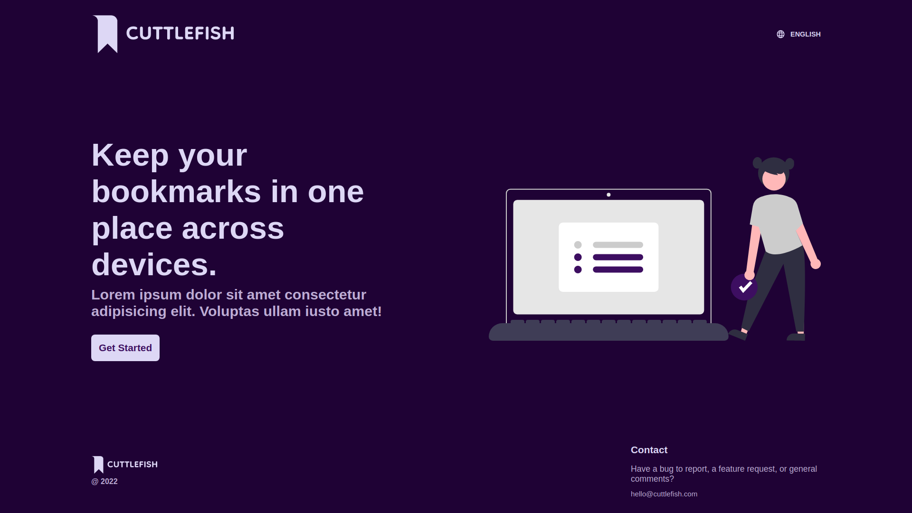

# CuttleFish

A website bookmark tracker.

_This project was originally built during Fullstack Academy Async week and continued through stackathon._

## What Problem Does It Solve?

CuttleFish was built to solve a single problem. That problem was having bookmarks across multiple browsers but not having easy access to them. There are several reasons why someone might use different browsers, for example, to differentiate work tasks from social tasks, browser and computer compatibility issues, incompatibility between browser extensions, not wanting to be tracked by websites, or even the browser itself, etc.

## What Tools Does It Use?

The major tools used to build CuttleFish are React, Express.js, Redux, and Sequelize. Tools used to secure user data are bcrypt, and JSON Web Token. The package used to retrieve URL data is cheerio.

## What Did You Learn?

While building this project I learned how useful Redux is. Instead of passing props down from component to component, it was much easier to manage state in a redux store. This meant React had to only render the data, instead of managing state.

## What Challenges Did You Face?

A major challenge I faced during Ascyn week was the database schema. Originally I wanted bookmarks and tags to belong to several users, that way there were no duplicate bookmarks and tags. The same for user's tags. The problem was that when retrieving a user's bookmark, along with the bookmark tags, it also shows tags other users had added. After revisiting this project for sackathon, the database schema was restructured to fix this issue.

## What Makes This Different?

Its feature of tagging bookmarks instead of storing them in folders differentiates it from similar applications. As a result, bookmarks can have multiple tags if they fall into several categories that the user has specified.
